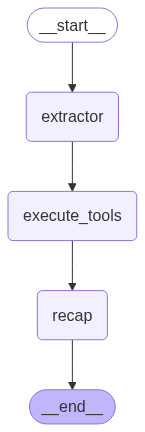

# LLM User Survey

A LangGraph-based survey system that extracts and validates user responses using AI agents. This project demonstrates how to build an intelligent survey system that can understand natural language responses and validate them against predefined criteria.

## Overview

The LLM User Survey system uses a multi-agent architecture to:

1. **Extract** information from user responses using AI
2. **Validate** the extracted data against predefined rules
3. **Provide feedback** to users about their responses

## Architecture

The system is built using LangGraph with a three-node workflow:



### Components

- **Extractor Node**: Uses AI to extract structured data from natural language responses
- **Tool Executor Node**: Validates extracted data against predefined rules
- **Recap Node**: Provides feedback and summary to the user

## Features

- **Natural Language Processing**: Understands user responses in natural language
- **Data Validation**: Validates extracted data against configurable rules
- **Structured Output**: Returns data in consistent, structured formats
- **Extensible Design**: Easy to add new questions and validation rules

## Installation

1. Clone the repository:

```bash
git clone <repository-url>
cd llm-user-survey
```

2. Install dependencies:

```bash
pip install -r requirements.txt
```

3. Set up environment variables:

```bash
cp .env.example .env
# Add your OpenAI API key to .env
```

## Usage

Run the main application:

```bash
python main.py
```

The system will process user input and extract/validate responses according to the configured questions.

## Configuration

### Adding New Questions

To add new survey questions, modify the `QUESTIONS` dictionary in `tool_executor.py`:

```python
QUESTIONS = {
    "How old are you?": {
        "instruction": "Extract age from user response",
        "min_value": 10,
        "max_value": 120
    },
    "What is your height?": {
        "instruction": "Extract height in centimeters",
        "min_value": 100,
        "max_value": 250
    }
}
```

### Customizing Validation Rules

Validation rules can be customized by modifying the `validate_answer` function in `tool_executor.py`.

## Project Structure

```
llm-user-survey/
├── main.py              # Main application entry point
├── chains.py            # LangChain chains and prompts
├── schemas.py           # Pydantic models for data validation
├── tool_executor.py     # Tool execution and validation logic
├── requirements.txt     # Python dependencies
├── graph.png           # Workflow visualization
└── README.md           # This file
```

## Dependencies

- **LangGraph**: For building the agent workflow
- **LangChain**: For AI chains and tools
- **OpenAI**: For language model integration
- **Pydantic**: For data validation and serialization

## Example

The system can handle responses like:

- Input: "I am 25 years old"
- Output: Extracted age: 25, Validation: ✅ (within 10-120 range)

## Contributing

1. Fork the repository
2. Create a feature branch
3. Make your changes
4. Add tests if applicable
5. Submit a pull request

## License

This project is licensed under the MIT License.
